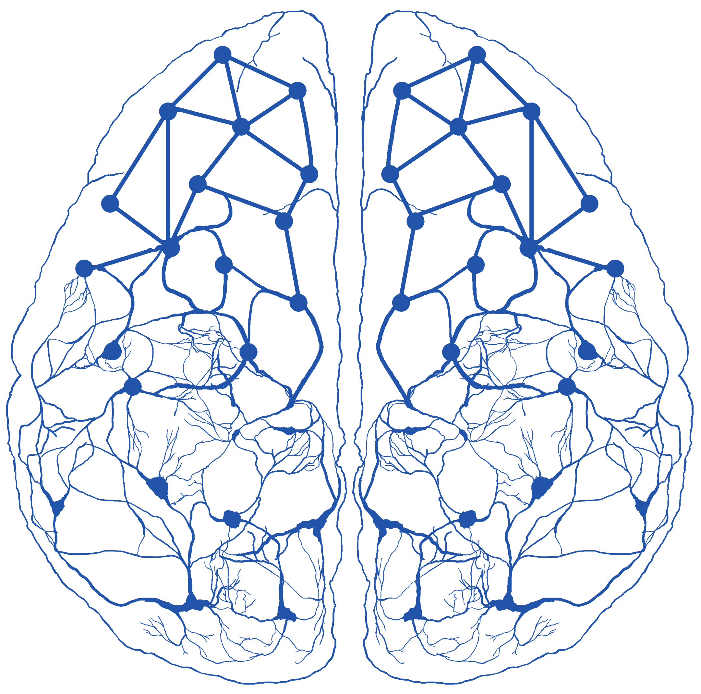

  

  
About us

    

      We are the Computational Systems Neuroscience Group (CSNG) based at the 
      <a href="https://www.mff.cuni.cz/">Faculty of Mathematics and Physics</a> of 
      <a href="https://cuni.cz">Charles University</a>, Prague.
    

    

      The main goal of our group is to identify computations implemented in the neural system that underlie our sensory perception, as well as applying this knowledge to the design of stimulation protocols for visual prosthetic systems. To that end, we build models of visual systems at various levels of abstraction using a variety of computational techniques including, but not limited to, machine learning and large-scale biologically plausible spiking neural network simulations.
    

    

      To help us with this endeavor, we also develop <a href="/software.html">Mozaik</a>, an open-source framework for rapid prototyping of large-scale neural simulations of sensory systems and automation of the virtual experimental workflow.
    

    More information is available in the "Join us!" section or at jan.antolik@mff.cuni.cz.
    

    

      

    
  

  

    
Collaborators

    <ul>
      <li>Karolína Korvasová (<a href="https://neam.mff.cuni.cz/">Charles University</a>) </li>
      <li>Diego Contreras (<a href="https://www.med.upenn.edu/apps/faculty/index.php/g275/p16954">University of Pennsylvania</a>) </li>
      <li>Andreas Tolias (<a href="https://toliaslab.org/">Stanford</a>)</li>
      <li>Serge Picaud lab (<a href="https://www.institut-vision.org/index.php/en/researchers/serge-picaud">Institut de la Vision</a>)</li>
      <li>Patric Degenae (<a href="https://www.ncl.ac.uk/engineering/staff/profile/patrickdegenaar.html">University of Newcastle</a>)</li>
      <li>Fabian Sinz (<a href="https://sinzlab.org/">University of Göttingen</a>)</li>
      <li>Eduardo Fernandez (<a href="https://nbio.umh.es/perfil-del-grupo/personal/eduardo-fernandez-jover/">Miguel Hernandez University</a>)</li>
      <li>Xing Chen (<a href="https://ophthalmology.pitt.edu/people/xing-chen-phd">University of Pittsburgh</a>)</li>
      <li>Alain Destexhe (<a href="https://neuropsi.cnrs.fr/en/departments/icn/group-leader-alain-destexhe/">NeuroPSI CNRS</a>)</li>
    </ul>
  

  

    
Contacts

    

      Computational System Neuroscience Group  
      Faculty of Mathematics and Physics 
      Charles University in Prague 
      Malostranské nám. 25 
      118 00 Prague 
      Czechia 
      email: <a href="mailto:antolikjan@gmail.com">antolikjan@gmail.com</a>
    

  

    

        <iframe src="https://maps.google.com/maps?width=100%25&amp;height=600&amp;hl=en&amp;q=+(Univerzita%20Karlova,%20Matematicko-fyzik%C3%A1ln%C3%AD%20fakulta,%20Informatick%C3%A1%20sekce)&amp;t=&amp;z=14&amp;ie=UTF8&amp;iwloc=B&amp;output=embed" height="450" style="border-radius:25px;border:0;width: 100%;height: 350px; margin-top:25px;" allowfullscreen="" loading="lazy"></iframe>
    

